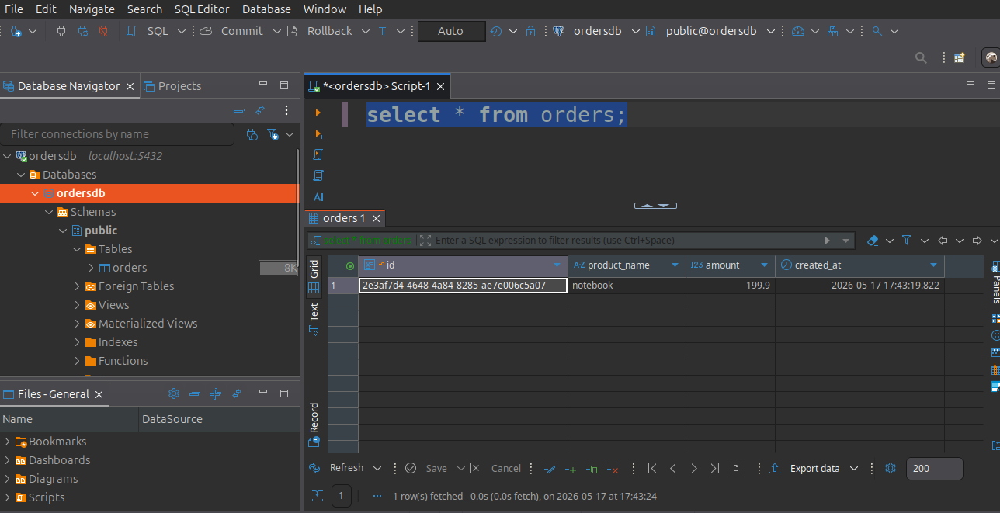
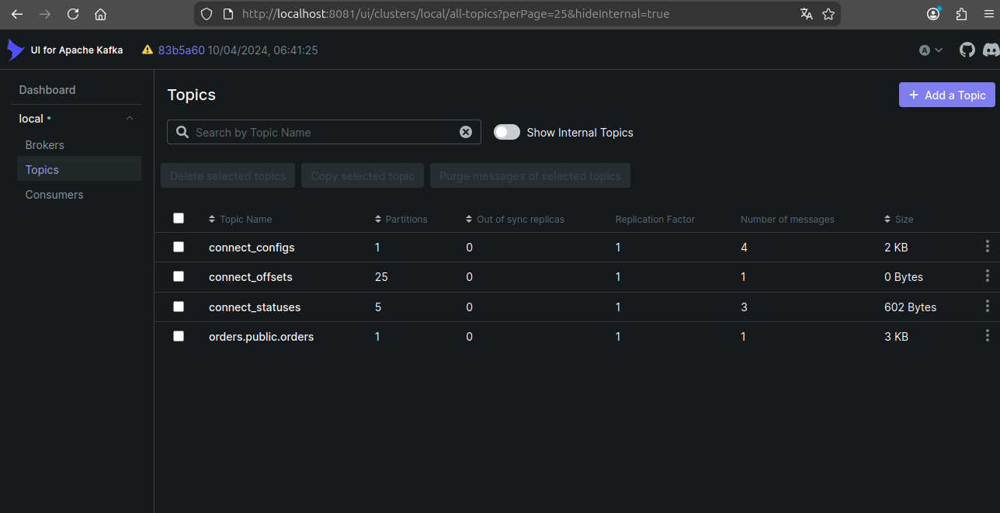
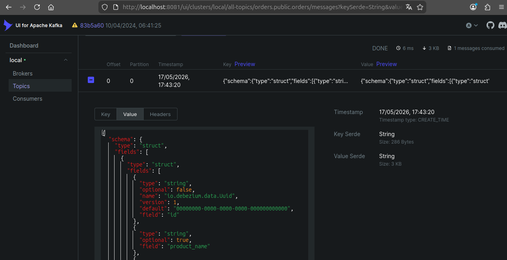

# Debezium POC

### Architecture

```
Spring Boot App
      |
      v
PostgreSQL  ---> Debezium ---> Kafka Topic
                          \
                           -> CDC Events
```

### Links

* Kafka UI: http://localhost:8081/

### Start
```bash
docker compose up
./start.sh
./register-postgres-connector.sh
./save-order.sh
```

### Clean Up

```bash
docker compose down -v --remove-orphans
```

### Resources

1. DB after insert
   

2. Kafka topics
   

3. Debezium Message
   

### Debezium Kafka Value

```json
{
	"schema": {
		"type": "struct",
		"fields": [
			{
				"type": "struct",
				"fields": [
					{
						"type": "string",
						"optional": false,
						"name": "io.debezium.data.Uuid",
						"version": 1,
						"default": "00000000-0000-0000-0000-000000000000",
						"field": "id"
					},
					{
						"type": "string",
						"optional": true,
						"field": "product_name"
					},
					{
						"type": "bytes",
						"optional": true,
						"name": "org.apache.kafka.connect.data.Decimal",
						"version": 1,
						"parameters": {
							"scale": "2",
							"connect.decimal.precision": "10"
						},
						"field": "amount"
					},
					{
						"type": "int64",
						"optional": true,
						"name": "io.debezium.time.MicroTimestamp",
						"version": 1,
						"default": 0,
						"field": "created_at"
					}
				],
				"optional": true,
				"name": "orders.public.orders.Value",
				"field": "before"
			},
			{
				"type": "struct",
				"fields": [
					{
						"type": "string",
						"optional": false,
						"name": "io.debezium.data.Uuid",
						"version": 1,
						"default": "00000000-0000-0000-0000-000000000000",
						"field": "id"
					},
					{
						"type": "string",
						"optional": true,
						"field": "product_name"
					},
					{
						"type": "bytes",
						"optional": true,
						"name": "org.apache.kafka.connect.data.Decimal",
						"version": 1,
						"parameters": {
							"scale": "2",
							"connect.decimal.precision": "10"
						},
						"field": "amount"
					},
					{
						"type": "int64",
						"optional": true,
						"name": "io.debezium.time.MicroTimestamp",
						"version": 1,
						"default": 0,
						"field": "created_at"
					}
				],
				"optional": true,
				"name": "orders.public.orders.Value",
				"field": "after"
			},
			{
				"type": "struct",
				"fields": [
					{
						"type": "string",
						"optional": false,
						"field": "version"
					},
					{
						"type": "string",
						"optional": false,
						"field": "connector"
					},
					{
						"type": "string",
						"optional": false,
						"field": "name"
					},
					{
						"type": "int64",
						"optional": false,
						"field": "ts_ms"
					},
					{
						"type": "string",
						"optional": true,
						"name": "io.debezium.data.Enum",
						"version": 1,
						"parameters": {
							"allowed": "true,last,false,incremental"
						},
						"default": "false",
						"field": "snapshot"
					},
					{
						"type": "string",
						"optional": false,
						"field": "db"
					},
					{
						"type": "string",
						"optional": true,
						"field": "sequence"
					},
					{
						"type": "int64",
						"optional": true,
						"field": "ts_us"
					},
					{
						"type": "int64",
						"optional": true,
						"field": "ts_ns"
					},
					{
						"type": "string",
						"optional": false,
						"field": "schema"
					},
					{
						"type": "string",
						"optional": false,
						"field": "table"
					},
					{
						"type": "int64",
						"optional": true,
						"field": "txId"
					},
					{
						"type": "int64",
						"optional": true,
						"field": "lsn"
					},
					{
						"type": "int64",
						"optional": true,
						"field": "xmin"
					}
				],
				"optional": false,
				"name": "io.debezium.connector.postgresql.Source",
				"field": "source"
			},
			{
				"type": "string",
				"optional": false,
				"field": "op"
			},
			{
				"type": "int64",
				"optional": true,
				"field": "ts_ms"
			},
			{
				"type": "int64",
				"optional": true,
				"field": "ts_us"
			},
			{
				"type": "int64",
				"optional": true,
				"field": "ts_ns"
			},
			{
				"type": "struct",
				"fields": [
					{
						"type": "string",
						"optional": false,
						"field": "id"
					},
					{
						"type": "int64",
						"optional": false,
						"field": "total_order"
					},
					{
						"type": "int64",
						"optional": false,
						"field": "data_collection_order"
					}
				],
				"optional": true,
				"name": "event.block",
				"version": 1,
				"field": "transaction"
			}
		],
		"optional": false,
		"name": "orders.public.orders.Envelope",
		"version": 2
	},
	"payload": {
		"before": null,
		"after": {
			"id": "2e3af7d4-4648-4a84-8285-ae7e006c5a07",
			"product_name": "notebook",
			"amount": "ThY=",
			"created_at": 1779039799822802
		},
		"source": {
			"version": "2.6.2.Final",
			"connector": "postgresql",
			"name": "orders",
			"ts_ms": 1779050599970,
			"snapshot": "false",
			"db": "ordersdb",
			"sequence": "[null,\"26655552\"]",
			"ts_us": 1779050599970731,
			"ts_ns": 1779050599970731000,
			"schema": "public",
			"table": "orders",
			"txId": 746,
			"lsn": 26655552,
			"xmin": null
		},
		"op": "c",
		"ts_ms": 1779050600059,
		"ts_us": 1779050600059523,
		"ts_ns": 1779050600059523368,
		"transaction": null
	}
}
```
