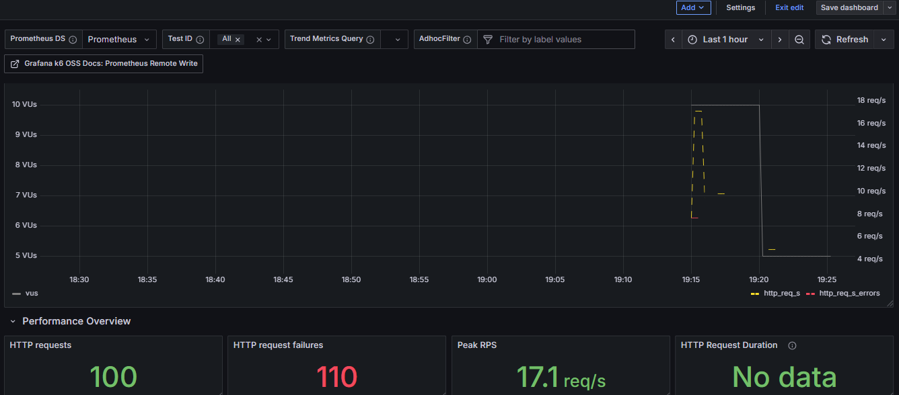

# Java 23 + Spring + Stress Test + K6

- [x] Java 23
- [x] Spring Rest Interface
- [x] Docker container
- [x] Stress test
- [x] Save results in postgres DB
- [x] Use test container to run it tests

## Endpoints

```bash
curl --location 'http://localhost:8080/v1/dungeons' \
--header 'Content-Type: application/json' \
--data '{
    "id": "546cdb04-3281-4602-86c2-8e01647a9271",
    "dungeon": [
        [-2, -3, 3],
        [-5, -10, 1],
        [10, 30, -5]
    ]
}'
```

```bash
curl --location 'http://localhost:8080/v1/dungeons'
```

```bash
curl --location 'http://localhost:8080/v1/dungeons/{{id}}'
```

## Stress
```bash
docker-compose up --build k6
```

```
TOTAL RESULTS
k6  |
k6  |     checks_total.......: 100     4.902/s
k6  |     checks_succeeded...: 100.00% 100 out of 100
k6  |     checks_failed......: 0.00%   0 out of 100
k6  |
k6  |     ✓ dungeon calculated
k6  |
k6  |     HTTP
k6  |     http_req_duration..............: avg=18.51ms min=9.37ms med=16.38ms max=49.07ms p(90)=25.7ms p(95)=27.75ms
k6  |       { expected_response:true }...: avg=18.51ms min=9.37ms med=16.38ms max=49.07ms p(90)=25.7ms p(95)=27.75ms
k6  |     http_req_failed................: 0.00% 0 out of 100
k6  |     http_reqs......................: 100   4.902/s
k6  |
k6  |     EXECUTION
k6  |     iteration_duration.............: avg=1.01s   min=1s     med=1.01s   max=1.05s   p(90)=1.02s  p(95)=1.02s
k6  |     iterations.....................: 100   4.902/s
k6  |     vus............................: 5     min=5        max=5
k6  |     vus_max........................: 5     min=5        max=5
k6  |
k6  |     NETWORK
k6  |     data_received..................: 23 kB 1.1 kB/s
k6  |     data_sent......................: 23 kB 1.1 kB/s
k6  |
k6  |
k6  |
k6  |
k6  | running (20.4s), 0/5 VUs, 100 complete and 0 interrupted iterations
k6  | default ✓ [ 100% ] 5 VUs  20s
```

## Usage

* Load sdkman environment

```bash
sdk env
```

* Run solution

```bash
./run.sh
```

* Run stress test

```bash
./stress.sh
```

* Clean up

```bash
./clean.sh
```

* Prometheus
  * http://localhost:9090

* Prometheus Push Gateway Exporter
  * http://localhost:9091/metrics

* Grafana
  * http://localhost:3000
  * user: admin
  * password: admin
  * https://grafana.com/grafana/dashboards/19665-k6-prometheus/
  

