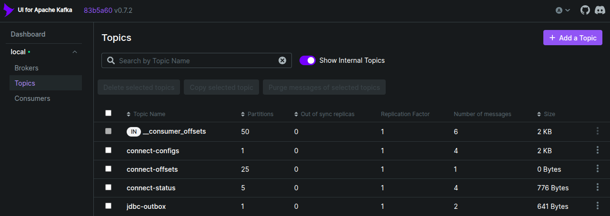
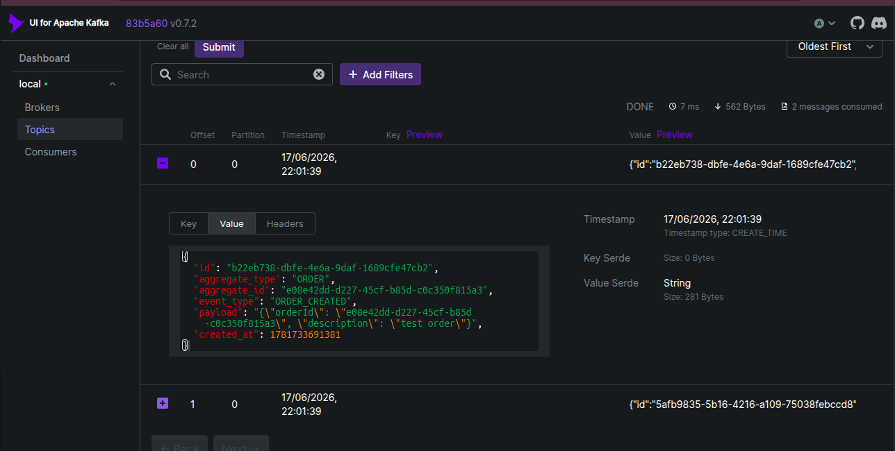

# JDBC Source Connector Outbox Pattern PoC

## Overview

This Proof of Concept demonstrates the Outbox Pattern using:

* Java 25
* Spring Boot 4.x
* Spring JDBC
* PostgreSQL
* Apache Kafka
* Kafka Connect JDBC Source Connector
* Docker Compose

---

## Solution Architecture

```text
+-------------------+
| Spring Boot App   |
|-------------------|
| Transactional     |
| business write +  |
| outbox insert     |
+---------+---------+
          |
          v
+-------------------+
| PostgreSQL        |
|-------------------|
| orders            |
| outbox            |
+---------+---------+
          |
          | polling
          v
+-------------------+
| Kafka Connect     |
| JDBC Source       |
| Connector         |
+---------+---------+
          |
          v
+-------------------+
| Apache Kafka      |
|-------------------|
| jdbc-outbox topic |
+-------------------+
```

---

## Running the PoC

1. Start infrastructure

```bash
docker compose down -v --remove-orphans
docker compose up
```

2. Setup JDBC connector
```bash
./setup-jdbc-connector.sh 
```

```
======================================
Registering JDBC Source Connector
======================================
{"name":"outbox-source","config":{"connector.class":"io.confluent.connect.jdbc.JdbcSourceConnector","tasks.max":"1","connection.url":"jdbc:postgresql://postgres:5432/outbox-jdbc","connection.user":"postgres","connection.password":"postgres","mode":"timestamp","timestamp.column.name":"created_at","table.whitelist":"outbox","topic.prefix":"jdbc-","poll.interval.ms":"5000","value.converter":"org.apache.kafka.connect.json.JsonConverter","value.converter.schemas.enable":"false","name":"outbox-source"},"tasks":[],"type":"source"}
```

3. Run Spring Boot application
```bash
./start
```

4. Create an order
```bash
./save-order.sh
```

5. Query table
```bash
docker exec -it outbox-postgres psql -U postgres -d outbox-jdbc
outbox-jdbc=# select * from orders;
outbox-jdbc=# select * from outbox;
```

## Output

* 
* 
* `jdbc-outbox` topic message value:
```json
{
	"id": "b22eb738-dbfe-4e6a-9daf-1689cfe47cb2",
	"aggregate_type": "ORDER",
	"aggregate_id": "e08e42dd-d227-45cf-b85d-c0c350f815a3",
	"event_type": "ORDER_CREATED",
	"payload": "{\"orderId\": \"e08e42dd-d227-45cf-b85d-c0c350f815a3\", \"description\": \"test order\"}",
	"created_at": 1781733691381
}
```

## Comparison With Debezium

The JDBC Source Connector polls a table and publishes rows based on query state.
Debezium streams committed database changes from the transaction log, so it behaves like true CDC.

| Topic             | JDBC Source Connector             | Debezium CDC                         |
| ----------------- | --------------------------------- | ------------------------------------ |
| Capture mechanism | SQL polling                       | WAL/binlog streaming                 |
| Change fidelity   | Current row state only            | Insert, update, delete events        |
| Latency           | Poll interval dependent           | Near real-time                       |
| Database load     | Repeated polling queries          | Reads transaction log                |
| Ordering          | Based on selected columns/query   | Based on database commit log         |
| Deletes           | Not captured from source table    | Captured when configured             |

## Links
* Kafka UI: http://localhost:8081/
