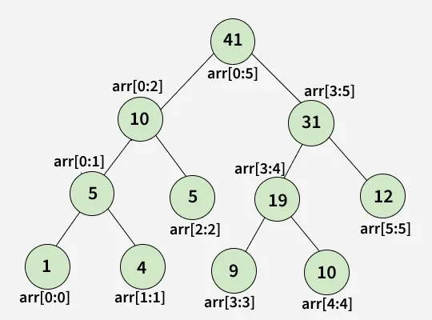

# Segment Tree POC

* input: [1, 4, 5, 9, 10, 12] of size 6
* segment tree:


## Outputs
```
Segment Tree POC!
Input: [1, 4, 5, 9, 10, 12]
SegmentTree{tree=[0, 41, 36, 5, 14, 22, 1, 4, 5, 9, 10, 12]}
└── 41
    ├── 36
    │   ├── 14
    │   │   ├── 5
    │   │   └── 9
    │   └── 22
    │       ├── 10
    │       └── 12
    └── 5
        ├── 1
        └── 4
Query [1, 5]: 28
Update index: 2 value: 10
SegmentTree{tree=[0, 46, 41, 5, 19, 22, 1, 4, 10, 9, 10, 12]}
└── 46
    ├── 41
    │   ├── 19
    │   │   ├── 10
    │   │   └── 9
    │   └── 22
    │       ├── 10
    │       └── 12
    └── 5
        ├── 1
        └── 4
After update Query [1, 5]: 33
```

### Tests 

```shell

```