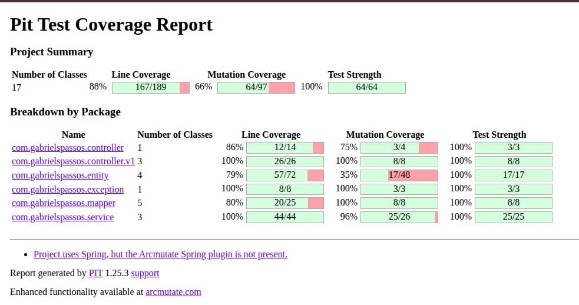

# Unit / Integration / Contract / Mutation Tests POC 

## Integration Test

- Proofs that some functionality works as expected
- Covers happy and unhappy paths
- Boots service, so is slower

## Contract 

- Proofs that the contract (API in this POC) is correct, no change break the contract
- Use mocks, so is fast

## Mutation

- Tests of Tests
  - `./test-mutation.sh`

- First report failed
```
================================================================================
- Statistics
  ================================================================================
>> Line Coverage (for mutated classes only): 167/189 (88%)
>> 37 tests examined
>> Generated 97 mutations Killed 64 (66%)
>> Mutations with no coverage 33. Test strength 100%
>> Ran 72 tests (0.74 tests per mutation)
```


## TODO Application

> Grocery TODO List system 
- [x] add item 
- [x] remove 
- [x] mark as done
- [x] do
- [x] re-do 
- [x] listAll

## Tests

```bash
[INFO] 
[INFO] Results:
[INFO] 
[INFO] Tests run: 55, Failures: 0, Errors: 0, Skipped: 0
[INFO] 
[INFO] 
```

- [x] Unit
- [x] Integration
- [x] Contract
- [x] Mutation
- [ ] Stress
- [ ] Chaos