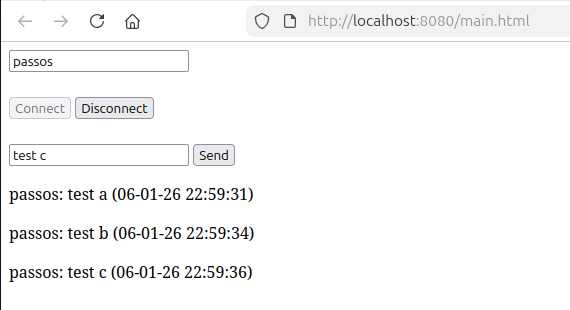

# Spring Boot Websockets POC

### Links
* UI: http://localhost:8080/main.html

### Output

### References 

* https://www.baeldung.com/websockets-spring
* https://medium.com/@wdkeyser/spring-boot-4-0-0-websockets-33801ad191db